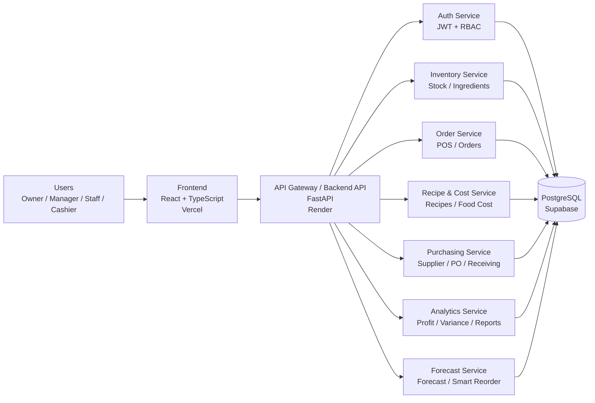
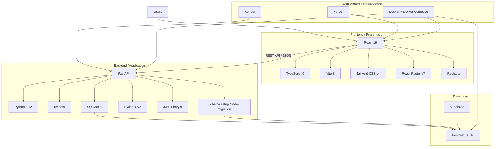
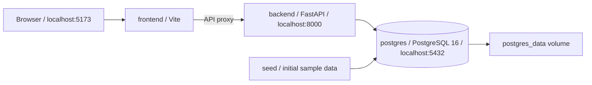

# KhunFlow

> อัปเดต 10 ตุลาคม 2026 · สถานะฟีเจอร์และผลตรวจล่าสุดอ้างอิงโค้ด `6972973`

## อัปเดตล่าสุดและสถานะโครงงาน

Frontend, Backend และฐานข้อมูลเชื่อมต่อและ deploy แล้ว ระบบหลักใช้งานผ่าน [เว็บ KhunFlow](https://khunflow.vercel.app) ได้ รายการนี้แทนการประเมิน 70% ในรายงานเดิม และไม่หมายความว่าทดสอบครบทุกสถานการณ์

| ส่วนงาน | สิ่งที่ทำแล้ว |
|---|---|
| บัญชีและธุรกิจ | สมัครร้าน สมาชิกหลายธุรกิจ และแยกข้อมูลตามร้าน |
| การขาย | สินค้า ออเดอร์/POS ตัดวัตถุดิบตามสูตร ยกเลิกและคืนสถานะตามสิทธิ์ |
| ต้นทุนและคลัง | สูตรอาหาร แปลงหน่วย ต้นทุนเฉลี่ย ตรวจนับสต็อก และของเสีย |
| จัดซื้อ | ผู้ขาย ใบสั่งซื้อ รับของบางส่วน ตรวจรับเกิน และอัปเดตต้นทุนสูตรหลังรับของ |
| รายงาน | Dashboard ยอดขาย กำไร วันหมดอายุ และประวัติกิจกรรม |
| สิทธิ์ | บันทึกสิทธิ์ในฐานข้อมูลแยกร้าน ตรวจสิทธิ์ที่ API และเมนูตามบทบาท |
| Deployment | Vercel Frontend, Render Backend, PostgreSQL บน Supabase |
| งานถัดไป | ทดลองสถานการณ์จริงของร้าน เก็บความคิดเห็น และตรวจกรณีที่ยังไม่ครอบคลุม |

### สิ่งที่เพิ่มและแก้ในรอบล่าสุด

- ประวัติออเดอร์ รับของ ของเสีย ใบสั่งซื้อ และกิจกรรมแบ่งหน้าละ 25 รายการ พร้อมตัวกรองวันที่ ยอดรวมยังครอบคลุมทั้งช่วงที่เลือก
- ลด query ซ้ำทีละรายการ ดึงข้อมูลเป็นชุด และเพิ่ม index ตามรูปแบบค้นหา
- Dashboard ใช้คำขอรวม รายการตรวจความพร้อมร้านใช้ `/setup-status` และโหลดแต่ละหน้าจอเมื่อเปิดใช้งาน
- รวม GET ที่เหมือนกันเฉพาะระหว่างกำลังโหลด ยกเลิกผลเก่าเมื่อเปลี่ยนหน้า ร้าน หรือบัญชี
- แก้หน้าที่หมุนค้าง ให้แสดงข้อผิดพลาดพร้อมปุ่มลองใหม่
- พนักงานคลังเริ่มที่คลัง แคชเชียร์เริ่มที่ POS เจ้าของปรับสิทธิ์ของพนักงานในร้านได้ การยกเลิก/คืนสถานะออเดอร์ยังจำกัดเจ้าของและผู้จัดการ
- รับของบางส่วนไม่ปิดใบสั่งซื้อ ตรวจยอดรับสะสม ป้องกันรับเกินและรับซ้ำหลังครบ ใบสั่งซื้อเก่าที่มีประวัติรับเชื่อมอยู่สามารถเปิดรับส่วนที่เหลือได้ตามสิทธิ์
- แก้การแปลงหน่วย `kg/g` และ `l/ml` ที่เข้ากันได้ คำนวณต้นทุนสูตรและสินค้าหลังต้นทุนเฉลี่ยเปลี่ยน
- วันหมดอายุบันทึกสถานะตรวจสอบ/ซ่อนในฐานข้อมูล รับล็อตใหม่เปิดแจ้งเตือนใหม่ การซ่อนแจ้งเตือนไม่ตัดสต็อก
- สินค้าที่ต้นทุนเป็นศูนย์ไม่เข้าอันดับกำไร และรายงานเตือนเมื่อกำไรเป็นประมาณการ
- เงินและเวลาเหตุการณ์แสดงตามสกุลเงิน/เขตเวลาร้าน เปลี่ยนสกุลเงินไม่แปลงตัวเลขย้อนหลัง
- แยกโหมดข้อมูลเดโมจากข้อมูลร้านจริง ตรวจนับรอบใหม่โหลดสต็อกล่าสุด และตรวจค่าจำนวน/ต้นทุนที่ไม่ถูกต้อง

### ผลตรวจล่าสุด

| การตรวจ | ผลที่บันทึก |
|---|---|
| `system_audit.py` | 85/85 ผ่าน |
| `test_audit_regression.py` | 37/37 ผ่าน |
| `test_performance_regression.py` | ผ่านการแบ่งหน้า ยอดรวม เขตเวลา สิทธิ์ แยกร้าน คาดการณ์ และกติกาสต็อก |
| Frontend build / lint | ผ่าน โดย lint ยังมี warnings |
| หน้าจอ local | เปิดตรวจ 18 เมนู พร้อมกรณีโหลดผิดพลาดและลองใหม่ |
| เว็บจริงหลังแก้ | ยืนยัน Backend revision `6972973` และบัญชีพนักงานคลังเข้าหน้าคลังได้ |

รวม 122 รายการจากสองชุดตรวจแรก ไม่ใช่จำนวนทุกปุ่มในเว็บ การทดสอบเขียนข้อมูลใช้ฐานแยก `khunflow_perf_test` ไม่ทำรายการขาย/รับของหรือเปลี่ยนสิทธิ์ร้านจริง

อ่าน [รายงานแก้บัค](docs/performance/system-audit-fixes.md) และ [รายงานตรวจระบบก่อนแก้](docs/performance/system-audit.md)

### ตัวอย่างผลวัดความเร็ว

วัดบน PostgreSQL 16 แยกด้วยข้อมูลชุดเดียวกัน เป็น median ของการเรียก handler 3 ครั้ง รวมสร้าง JSON แต่ไม่รวม HTTP การยืนยันตัวตน อินเทอร์เน็ต หรือเวลาปลุก Render

| รายการ | ก่อน | หลัง |
|---|---:|---:|
| อ่านออเดอร์ทั้งหมด 1,000 รายการ | 1,618.42 ms / 2,001 queries | 61.06 ms / 2 queries |
| อ่านประวัติรับของ 1,000 รายการ | 1,835.46 ms / 2,001 queries | 61.48 ms / 3 queries |
| JavaScript ไฟล์แรก | 915.86 KB | 286.44 KB |
| ข้อมูลหน้าออเดอร์ | 234,993 bytes ทั้งประวัติ | 5,980 bytes หน้าแรก 25 รายการพร้อมยอดรวม |

เป็นผลของชุดปรับความเร็ววันที่ 10 ตุลาคม 2026 ไม่ใช่การวัดทุกเมนูบน revision ล่าสุดหรือการรับประกันความเร็วเว็บจริง ดู [วิธีทดสอบซ้ำ ผลดิบ และ EXPLAIN](docs/performance/README.md)

### ข้อจำกัดและงานที่ยังต้องตรวจ

- การคาดการณ์ปัจจุบันใช้ยอดขายเฉลี่ยย้อนหลัง 30 วัน ยังไม่ใช่โมเดล ML ที่ผ่านการประเมินความแม่นยำ
- รอบตรวจล่าสุดยังไม่ได้ยืนยัน Google OAuth จนจบ การส่งอีเมลจริง การพิมพ์ PDF ทุกขนาดจอ หรือการเขียนสต็อกพร้อมกันจำนวนมาก
- ใบสั่งซื้อเก่าที่ไม่มีประวัติรับเชื่อมกับ PO ต้องตรวจข้อมูลก่อน ไม่แก้ยอดย้อนหลังอัตโนมัติ
- ทดลองใช้งานกับสถานการณ์จริงของร้านและเก็บความคิดเห็นผู้ใช้

---

> **ระบบบริหารธุรกิจอาหารและร้านกาแฟ: "รู้ต้นทุน รู้กำไร คุมวัตถุดิบให้คุ้ม"**  
> เจ้าของร้านและผู้จัดการสามารถติดตามสต็อกวัตถุดิบ คำนวณต้นทุนจากสูตรอาหารจริง วิเคราะห์กำไร บันทึกของเสีย และรับคำแนะนำการสั่งซื้อจากข้อมูลย้อนหลังในระบบเดียว

---

## 1. ข้อมูลโครงงานและผู้จัดทำ (Project Information)

* **ชื่อโครงงาน**: KhumFlow — Food Business Management System
* **ผู้จัดทำ**:
  - **นายภูริพัฒน์ ตานน้อย** รหัสนิสิต `67160230`
  - **นายกฤษฎา โถรัตน์** รหัสนิสิต `67160313`
* **Live Web App (Vercel)**: https://khunflow.vercel.app
* **API Documentation (Render)**: https://khunflow.onrender.com/docs
* **GitHub Repository**: https://github.com/67160230-byte/Khunflow
* **คำอธิบาย**: ระบบบริหารจัดการธุรกิจอาหาร ร้านกาแฟ และเบเกอรี่ แบบครบวงจร ออกแบบสำหรับธุรกิจในประเทศไทย ครอบคลุมตั้งแต่การบันทึกออเดอร์ คำนวณต้นทุนสูตรอาหาร ติดตามวัตถุดิบ ไปจนถึงการคาดการณ์ยอดขายจากข้อมูลย้อนหลัง

---

## 2. สถาปัตยกรรมระบบและเทคโนโลยี (Tech Stack & Architecture)

| ส่วนของระบบ (Layer) | เทคโนโลยี / มาตรฐานที่เลือกใช้ |
|---|---|
| **Frontend Framework** | React 19 + TypeScript 6 (Vite 8) เรียก API ด้วย `fetch()` |
| **Design System** | Tailwind CSS v4, Green Theme, Lucide Icons, Recharts, clsx |
| **Routing** | React Router v7 (Nested Routes + `<Outlet />`) |
| **UI Components** | KPICard, AlertCard, Badge, SectionHeader, Sidebar Drawer, Topbar, POS Modal |
| **Backend Framework** | FastAPI (Python 3.12) ตามมาตรฐาน RESTful Architecture |
| **Data & ORM** | SQLModel (Pydantic v2 + SQLAlchemy Async) |
| **Database Engine** | PostgreSQL 16 (Supabase Cloud Database) |
| **Database Migration** | SQLModel create_all + additive schema setup; concurrent index migration |
| **Authentication** | JWT (python-jose) + bcrypt (passlib) พร้อม Role-based Access Control (Owner, Manager, Inventory Staff, Cashier) |
| **Cloud Deployment** | Vercel (Frontend SPA) + Render (Backend API) + Supabase (Database) |
| **Containerization** | Docker & Docker Compose (Multi-Container Environment) |


---

## 2.1 Lab Progress — Project Integration

หัวข้อนี้จัดทำตามโจทย์ **Lab Progress - Project Integration** โดยต้องดำเนินการ Integrate ระบบให้ได้มากที่สุด และแนบเอกสาร Architecture ไว้ใน GitHub Repository

### สถานะสำหรับ Lab Progress

Frontend, Backend และฐานข้อมูลเชื่อมต่อแล้ว และ deploy บน Vercel / Render / Supabase ระบบหลักและผลตรวจล่าสุดแสดงในหัวข้ออัปเดตด้านบน มี Architecture และ Technology Stack Diagram ในเอกสารนี้ ส่วนที่เหลือคือทดลองใช้งานจริง เก็บความคิดเห็น และตรวจกรณีเพิ่มเติมตามข้อจำกัดที่ระบุ ไม่ใช้เปอร์เซ็นต์ประมาณการเดิมเป็นผลตรวจ

> **หมายเหตุ:** KhumFlow ในการ Deploy ปัจจุบันยังเป็น Frontend + FastAPI Backend + PostgreSQL/Supabase โดย Backend ยังไม่ได้แยกเป็น Microservices ที่ Deploy แยกกันทุก Service ดังนั้น Microservices Diagram ด้านล่างเป็น **Logical / Target Architecture** สำหรับแสดงแนวทางการออกแบบระบบตามโจทย์ Lab ไม่ใช่การอ้างว่าทุก Service ถูก Deploy แยกจริงแล้ว

### 1) Microservices Architecture



### 2) Technology Stack Diagram



### สิ่งที่ต้องทำก่อนส่ง Lab

1. ตรวจสอบว่า Frontend, Backend และ Database ยังเชื่อมต่อและใช้งานได้
2. Push งานล่าสุดทั้งหมดขึ้น GitHub
3. ตรวจสอบให้มี **Microservices Architecture** ใน Repository
4. ตรวจสอบให้มี **Technology Stack Diagram** ใน Repository
5. ประเมินความคืบหน้าโครงงานจากงานที่ทำเสร็จจริง
6. ส่ง URL GitHub Repository ล่าสุดให้ TA
7. รายงานสั้น ๆ ว่า **ส่วนไหนเสร็จแล้ว / ส่วนไหนยังไม่เสร็จ**

**GitHub Repository:** https://github.com/67160230-byte/Khunflow

**Live Web App:** https://khunflow.vercel.app

**API Documentation:** https://khunflow.onrender.com/docs

---

## 3. สถาปัตยกรรมและการทำงานภายใน Docker (Docker Multi-Container Architecture)

ชุดพัฒนาใน `docker-compose.yml` มี 4 services: `frontend`, `backend`, `postgres` และ `seed` ไม่มี pgAdmin ใน Compose ปัจจุบัน



- Frontend ใช้ source bind mount สำหรับการพัฒนา
- Backend เริ่มด้วย `init_db()` เพื่อสร้างตารางที่ขาดและเพิ่มโครงสร้างแบบไม่รีเซ็ตข้อมูล จากนั้นตรวจ/สร้าง performance indexes นอก transaction ไม่ได้เรียก Alembic migration อัตโนมัติใน startup ปัจจุบัน
- Seed runner รันแยกก่อน Backend เพื่อสร้างข้อมูลตัวอย่าง
- ข้อมูล PostgreSQL เก็บใน volume `postgres_data`
- Compose ชุดพัฒนากำหนด database credentials และ JWT secret ไว้ในไฟล์ การเปลี่ยน `DB_PASSWORD` หรือ `JWT_SECRET` ใน `.env` เพียงอย่างเดียวไม่ได้แทนค่าที่เขียนไว้ใน Compose ชุดนี้

---

## 4. โครงสร้างโปรเจกต์ (Project Directory Structure)

```text
Khunflow/
├── frontend/                              # React + TypeScript + Vite Frontend
│   ├── src/
│   │   ├── components/
│   │   │   ├── ui/                        # Reusable UI: Badge, Button, Card, KPICard, AlertCard, EmptyState...
│   │   │   └── layout/
│   │   │       └── AppLayout.tsx          # Sidebar (RBAC Nav), Topbar, Mobile Drawer, <Outlet />
│   │   ├── pages/
│   │   │   ├── LandingPage.tsx            # หน้า Landing (Hero + Features + CTA)
│   │   │   ├── LoginPage.tsx              # หน้า Login (เข้าสู่ระบบ + สมัครร้านใหม่)
│   │   │   ├── ComingSoon.tsx             # Placeholder component
│   │   │   ├── dashboard/
│   │   │   │   └── DashboardPage.tsx      # KPI Cards + 3 Recharts (Sales, FoodCost, Profit) + Alerts
│   │   │   ├── orders/
│   │   │   │   └── OrdersPage.tsx         # POS Interface + Modal + ตัดสต็อกตามสูตรอาหาร
│   │   │   ├── products/
│   │   │   │   └── ProductsPage.tsx       # จัดการสินค้า, ราคาขาย, Margin %
│   │   │   ├── recipes/
│   │   │   │   └── RecipesPage.tsx        # สูตรอาหาร, วัตถุดิบ, ต้นทุนคำนวณอัตโนมัติ
│   │   │   ├── inventory/
│   │   │   │   └── InventoryPage.tsx      # คลังวัตถุดิบ, ต้นทุนเฉลี่ย, จุดสั่งซื้อขั้นต่ำ
│   │   │   ├── stockCount/
│   │   │   │   └── StockCountPage.tsx     # ตรวจนับสต็อกจริง, คำนวณ Variance Real-time
│   │   │   ├── waste/
│   │   │   │   └── WastePage.tsx          # บันทึกของเสีย, ระบุสาเหตุ, ปรับสต็อก
│   │   │   ├── purchasing/
│   │   │   │   ├── SuppliersPage.tsx      # จัดการซัพพลายเออร์
│   │   │   │   ├── PurchaseOrdersPage.tsx # ใบสั่งซื้อ Draft → Ordered → Received
│   │   │   │   └── ReceivingPage.tsx      # รับสินค้าเข้าคลัง + Lot + วันหมดอายุ
│   │   │   ├── analytics/
│   │   │   │   ├── VariancePage.tsx       # Variance Analysis (Expected vs Actual)
│   │   │   │   ├── AnalyticsPages.tsx     # ExpirationPage, ProfitPage
│   │   │   ├── forecast/
│   │   │   │   └── ForecastPage.tsx       # Sales Forecast 7 วัน + Smart Reorder
│   │   │   ├── reports/
│   │   │   │   └── ReportsPage.tsx        # รายงานสรุปธุรกิจรายวัน + ดาวน์โหลด PDF
│   │   │   └── settings/
│   │   │       ├── SettingsPages.tsx      # UsersPage (เพิ่มพนักงาน), BusinessInfoPage
│   │   │       ├── RolesPage.tsx          # RBAC Permission Matrix
│   │   │       └── AuditPage.tsx          # Audit Logs ประวัติการใช้งาน
│   │   ├── services/
│   │   │   └── index.ts                   # API-ready Service Layer (Mock → REST)
│   │   ├── mocks/
│   │   │   └── index.ts                   # ข้อมูลตัวอย่างร้านกาแฟไทย (Products, Ingredients, Orders...)
│   │   ├── types/
│   │   │   └── index.ts                   # TypeScript Interfaces ครบทุก Domain
│   │   └── router/
│   │       └── index.tsx                  # React Router v7 Nested Routes
│   ├── vercel.json                        # Vercel SPA Routing Configuration
│   ├── Dockerfile                         # Multi-stage: dev / builder / production
│   ├── nginx.conf                         # SPA Routing + Gzip + Asset Caching
│   ├── package.json
│   └── vite.config.ts
│
├── backend/                               # FastAPI Backend
│   ├── app/
│   │   ├── main.py                        # FastAPI App + CORS + Lifespan (Schema setup + Index migration)
│   │   ├── config.py                      # Settings (pydantic-settings, .env support)
│   │   ├── database.py                    # Async SQLAlchemy Engine (Supabase Pooler Support)
│   │   ├── models/
│   │   │   └── __init__.py                # SQLModel Tables: Business, User, Ingredient, Product,
│   │   │                                  #   Recipe, RecipeItem, Order, OrderItem, WasteRecord,
│   │   │                                  #   StockCount, StockCountItem, Supplier,
│   │   │                                  #   PurchaseOrder, PurchaseOrderItem, GoodsReceiving
│   │   ├── schemas/
│   │   │   └── __init__.py                # Pydantic Request/Response Schemas
│   │   ├── services/
│   │   │   └── auth_service.py            # bcrypt Hash, JWT Create/Decode, get_current_user
│   │   └── routers/
│   │       ├── auth.py                    # POST /api/auth/login, /register, GET /me
│   │       ├── inventory.py               # CRUD Products, Ingredients, Recipes, Receiving
│   │       └── operations.py              # Orders (ตัดสต็อก), StockCount (Variance), Waste
│   ├── alembic/                           # Database Migration Version Control
│   │   ├── versions/                      # ไฟล์ Migration แต่ละเวอร์ชัน
│   │   └── env.py                         # เชื่อมโยง SQLModel.metadata เข้ากับ Alembic
│   ├── seed.py                            # Initial Data Seeder (Users + Demo Ingredients/Products)
│   ├── requirements.txt
│   └── Dockerfile
│
├── docker-compose.yml                     # Development (Frontend + Backend + PostgreSQL + Seed)
├── .env.example                           # Environment Variables Template
├── .gitignore
└── README.md
```

---

## 5. การเข้าใช้งานและติดตั้ง (Usage & Installation)

### 🌐 ใช้งานผ่านระบบออนไลน์ (Live Cloud Deployment)

| บริการ | URL | คำอธิบาย |
|---|---|---|
| **Web Application** | https://khunflow.vercel.app | หน้าเว็บหลัก KhumFlow พร้อมใช้งาน |
| **API Swagger UI** | https://khunflow.onrender.com/docs | เอกสารและทดสอบ FastAPI Endpoints |
| **API Health Check** | https://khunflow.onrender.com/api/health | ตรวจสอบสถานะการทำงานของ Backend |

### หลังบ้านผู้ดูแลแพลตฟอร์ม

บัญชีผู้ดูแลแพลตฟอร์มแยกจาก Owner ของร้าน กำหนดอีเมลผู้ดูแลแบบเจาะจงใน Render ที่ **Web Service → Environment → `PLATFORM_ADMIN_EMAILS`** เช่น `your-login@example.com` (หลายบัญชีคั่นด้วย comma) แล้ว deploy ใหม่ จากนั้นเข้าสู่ระบบด้วยอีเมลนั้นและเปิดเมนู **จัดการสมาชิก KhumFlow** บัญชีที่ไม่ได้อยู่ในรายการนี้จะเข้าหลังบ้านไม่ได้

หลังบ้านแสดงบัญชีเจ้าของธุรกิจและชื่อธุรกิจเท่านั้น สามารถบันทึกแพ็กเกจทดลองใช้/รายเดือน/รายปี/ตลอดชีพและสถานะชำระเงินได้ การตั้งสถานะ **ระงับแพ็กเกจ** จะปิดการเข้าถึงของธุรกิจและพนักงานในธุรกิจนั้น โดยเก็บข้อมูลเดิมไว้เพื่อประวัติและเปิดใช้คืนได้ ระบบยังไม่เชื่อมต่อ payment gateway จึงต้องตรวจยอดและบันทึกการชำระด้วยตนเอง

---

### 💻 รันบนเครื่อง Local ผ่าน Docker

```powershell
# 1. Clone โปรเจกต์
git clone https://github.com/67160230-byte/Khunflow.git
cd Khunflow

# 2. คัดลอกไฟล์ Environment Variables
Copy-Item .env.example .env

# 3. รันทั้งระบบด้วย Docker Compose
docker compose up --build
```

---

## 6. บัญชีผู้ใช้งานระบบ (Default Accounts)

| บทบาท (Role) | Email | Password | สิทธิ์การใช้งาน |
|---|---|---|---|
| **Owner** (เจ้าของร้าน) | `admin@khumflow.app` | `admin1234` | เข้าถึงได้ **ทุกส่วน** ของระบบ |
| **Manager** (ผู้จัดการ) | `manager@khumflow.app` | `manager1234` | ทุกส่วน ยกเว้นตั้งค่าระบบ |
| **Inventory Staff** (พนักงานคลัง) | `stock@khumflow.app` | `stock1234` | คลัง, ตรวจนับ, ของเสีย, จัดซื้อ |
| **Cashier** (แคชเชียร์) | `cashier@khumflow.app` | `cashier1234` | บันทึกออเดอร์เท่านั้น |

> 💡 **สามารถสร้างร้านใหม่ของตัวเองได้:** ผ่านแท็บ **"สมัครร้านใหม่"** ที่หน้าแรกของเว็บ หรือเพิ่มพนักงานในเมนู **"ตั้งค่า ➔ ผู้ใช้งาน"**

---

## 7. ฟีเจอร์หลักของระบบ (Key Features)

1. **Dashboard & KPI Monitoring**
   - KPI Cards: ยอดขายวันนี้, Food Cost %, กำไรขั้นต้น, มูลค่าของเสีย
   - กราฟยอดขายย้อนหลัง 7 วัน (Area Chart), Food Cost Comparison (Bar Chart), แนวโน้มกำไร (Line Chart)
   - แจ้งเตือนอัตโนมัติ: วัตถุดิบใกล้หมด, วันหมดอายุ, Variance ผิดปกติ

2. **Recipe-based Cost Engine**
   - กำหนดสูตรอาหารพร้อมสัดส่วนวัตถุดิบ ระบบคำนวณต้นทุนต่อเมนูอัตโนมัติ
   - บันทึกออเดอร์แล้วตัด Expected Stock ตามสูตรทันที

3. **Inventory & Stock Count**
   - ติดตามสต็อกคงเหลือ ต้นทุนเฉลี่ย (Weighted Average) และจุดสั่งซื้อขั้นต่ำ
   - ตรวจนับสต็อกจริง คำนวณ Variance (ส่วนต่าง) และมูลค่าสูญเสีย Real-time

4. **Purchasing & Receiving**
   - จัดการซัพพลายเออร์และใบสั่งซื้อ (PO) ตั้งแต่ Draft → Ordered → Received
   - รับสินค้าเข้าคลังพร้อม Lot Number, วันหมดอายุ, อัปเดตต้นทุนเฉลี่ยอัตโนมัติ

5. **Analytics & Reports**
   - วิเคราะห์ Food Cost, Variance, กำไรแยกเมนู
   - รายงานสรุปธุรกิจรายวัน พร้อมส่งออก PDF

6. **Sales Forecast & Reorder**
   - คาดการณ์ยอดขายล่วงหน้า 7 วันจากยอดขายเฉลี่ยย้อนหลัง 30 วัน ยังไม่ใช่โมเดล ML ที่ประเมินความแม่นยำแล้ว
   - คำนวณปริมาณสั่งซื้อที่เหมาะสม: `(Forecast Usage - Current Stock) + Safety Stock`
   - ออกใบสั่งซื้อ (PO) จาก Recommendation ได้โดยตรง

7. **RBAC & User Management**
   - 4 Roles: Owner, Manager, Inventory Staff, Cashier
   - Audit Logs บันทึกกิจกรรมที่ระบบรองรับสำหรับตรวจสอบย้อนหลัง
   - เจ้าของปรับสิทธิ์ของพนักงานในร้านได้ โดยบันทึกในฐานข้อมูลและตรวจที่ API

---

## 8. รายการ RESTful API Endpoints

- **Auth:** `POST /api/auth/login`, `POST /api/auth/register`, `GET /api/auth/me`
- **Products:** `GET /api/products`, `POST /api/products`, `GET /api/products/{id}`, `PUT /api/products/{id}`, `DELETE /api/products/{id}`
- **Ingredients:** `GET /api/ingredients`, `POST /api/ingredients`, `PUT /api/ingredients/{id}`, `DELETE /api/ingredients/{id}`
- **Recipes:** `GET /api/recipes`, `POST /api/recipes`, `GET /api/recipes/{id}`, `PUT /api/recipes/{id}`
- **Orders:** `GET /api/orders`, `POST /api/orders` (ตัดสต็อกอัตโนมัติ), `GET /api/orders/{id}`
- **Stock Count:** `GET /api/stock-counts`, `POST /api/stock-counts` (คำนวณ Variance + Sync สต็อก)
- **Waste:** `GET /api/waste`, `POST /api/waste` (ปรับสต็อก)
- **Suppliers:** `GET /api/suppliers`, `POST /api/suppliers`, `PUT /api/suppliers/{id}`
- **Purchase Orders:** `GET /api/purchase-orders`, `POST /api/purchase-orders`, `PUT /api/purchase-orders/{id}/status`
- **Receiving:** `POST /api/receiving` (อัปเดต Weighted Average Cost)
- **Health:** `GET /api/health`


## 9. การตั้งค่า deployment และ API ใหม่

| ตัวแปร | การใช้งาน |
|---|---|
| `DATABASE_URL` | การเชื่อมต่อ PostgreSQL ของ Backend |
| `JWT_SECRET` | Secret ของระบบจริง ต้องตั้งค่าเฉพาะและมีอย่างน้อย 32 ตัวอักษร |
| `ENVIRONMENT` | ใช้ `production` บนระบบจริง |
| `MIGRATION_DATABASE_URL` | Direct/session connection ของฐานเดียวกัน สำหรับ concurrent index migration เมื่อแอปใช้ transaction pooler |
| `DEMO_MODE` | `true` เปิด reset ด้วยอีเมลโดยไม่ใช้ OTP สำหรับระบบตัวอย่าง ค่าเริ่มต้น `false` |
| `PLATFORM_ADMIN_EMAILS` | อีเมลผู้ดูแลแพลตฟอร์ม คั่นด้วย comma |
| `RESEND_API_KEY`, `RESEND_FROM_EMAIL` | การส่งอีเมล reset ผ่าน HTTPS |
| `VITE_API_URL` | Base URL ของ API หากเรียกโดยตรง ปล่อยว่างเพื่อใช้ `/api` ผ่าน rewrite/proxy |

ตั้งค่า Backend บน Render และ Frontend บน Vercel แยกกัน ไม่ใส่ข้อมูลเชื่อมต่อฐานข้อมูลหรือ JWT secret ในตัวแปร `VITE_*` โหมดข้อมูลเดโมในหน้าเว็บกับ `DEMO_MODE` สำหรับ reset รหัสผ่านเป็นคนละการตั้งค่า

Frontend ส่ง `/api` ต่อไป Render ตาม `frontend/vercel.json` Backend ปัจจุบันเป็นแอปเดียวที่แยกโมดูลภายใน ยังไม่ได้ deploy แต่ละโมดูลเป็น Microservice แยกกัน

### API ที่เพิ่ม

- `GET/PUT /api/auth/permissions`: อ่านและบันทึกสิทธิ์แยกตามร้าน เจ้าของเท่านั้นที่แก้ได้
- `GET/PUT /api/expiration-status`: สถานะตรวจสอบ/ซ่อนวันหมดอายุ
- `POST /api/purchase-orders/{id}/reopen`: เปิดรับส่วนที่เหลือตามสิทธิ์และประวัติรับเดิม
- `GET /api/setup-status`: สถานะเตรียมร้าน 5 ขั้นตอนและคำเตือนต้นทุน
- `GET /api/orders/paged`, `/api/receiving/paged`, `/api/waste/paged`, `/api/purchase-orders/paged`, `/api/auth/audit-logs/paged`: ประวัติแบ่งหน้า

API ประวัติรับ `page`, `limit`, `from`, `to` วันที่เป็น `YYYY-MM-DD` เริ่มหน้าที่ 1 ขนาดปกติ 25 สูงสุด 100 ตอบ `{items, page, limit, total}` บางประวัติมี `summary` ของทั้งช่วงเพิ่มเติม เรียงเวลาใหม่ก่อนและใช้ ID เป็นลำดับรองเมื่อเวลาเท่ากัน เส้นทางรายการเดิมยังคงไว้

### ตรวจ deployment และ index

[Health](https://khunflow.vercel.app/api/health) ตอบ `revision` ของ Backend และ `performance_indexes_ready` ของ instance ที่ทำงาน ค่า `true` หมายถึงตรวจ index ที่ต้องการหรือ index ที่เทียบเท่าแล้ว การ push สำเร็จเพียงอย่างเดียวไม่ยืนยันว่า deploy หรือสร้าง index สำเร็จ

Migration รันซ้ำได้ ใช้ `CREATE INDEX CONCURRENTLY` นอก transaction และต้องใช้ direct/session connection หากแอปใช้ transaction pooler ดู [คู่มือ performance](docs/performance/README.md#rollout-and-actual-index-status) ใช้ฐานทดสอบตามคู่มือเท่านั้นสำหรับชุดทดสอบ ห้ามใช้คำสั่งรีเซ็ต/seed ชุดทดลองกับฐานจริง
